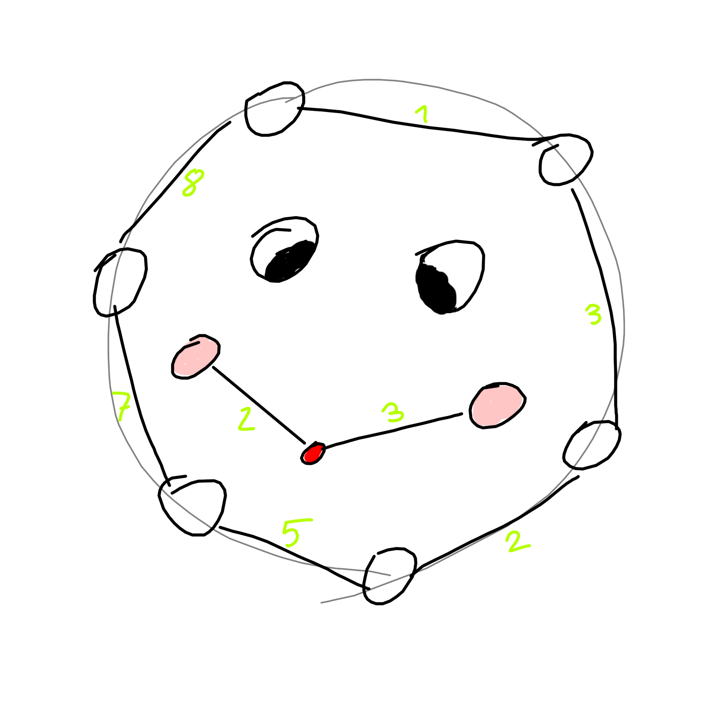

# Pretty Graph Algorithms
_Graph go brrrr_

---

## About

A small project to give nice visual representations of several popular/efficient algorithms on graphs. I enjoy looking at it just as much as I do. (Also, it was nice to brush up on my TypeScript, npm, webpack, etc. skills ^^).

## Demo

You should be able to find a live-demo [here](https://mattmoony.github.io/pretty-graph-algorithms).

## Roadmap

* [x] Controls
  * [x] Algorithm Selection
  * [x] Speed control
* [ ] Algorithms
  * [x] Depth-First-Search
  * [x] Breadth-First-Search
  * [x] Dijkstra's Algorithm
  * [x] A* Algorithm
  * [x] Prim's Algorithm
  * [ ] Kruskal's Algorithm
* [x] Core
  * [x] Classes
    * [x] Graph
    * [x] Node
    * [x] Canvas
    * [x] PriorityQueue
  * [x] Interfaces
    * [x] Edge
    * [x] Pair

---

... Matthias M. (June 2020)
